# Askwell — product walkthrough

Askwell turns a company's help docs into a support assistant that answers with citations, works as a chat inside the app and as a widget on any website, and tells you which questions your docs *can't* answer yet.

- **Live app:** https://askwell-nine.vercel.app
- **Demo account:** `demo@askwell.app` / `askwell-demo-2026` (already has the "Nimbus Help" assistant set up)
- **Source:** https://github.com/LedenevS/askwell
- **Stack:** Next.js 16 · Supabase (Postgres + pgvector, Auth, RLS) · OpenRouter (any model; defaults to `openai/gpt-4o-mini` + `text-embedding-3-small`) · Vercel

The walkthrough below follows the exact path a new customer takes, from the landing page to an embedded widget on their own site.

---

## 1. Landing page

The landing page explains the product in one sentence, offers a **live demo** you can talk to before signing up, and shows pricing without hiding anything. The demo assistant is trained on the docs of a fictional analytics product called *Nimbus*, so anyone can test real answers.

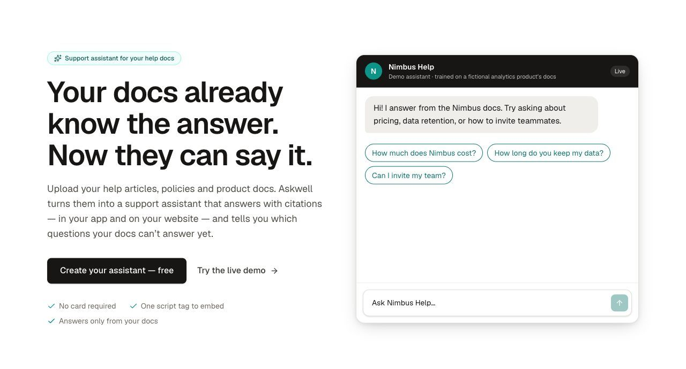

Pricing is three plans. Every limit that matters (answers per month, assistants, sources, branding, domain lock, history) is spelled out on the card, and the same numbers drive the gating inside the app — there is a single source of truth in `src/lib/plans.ts`.

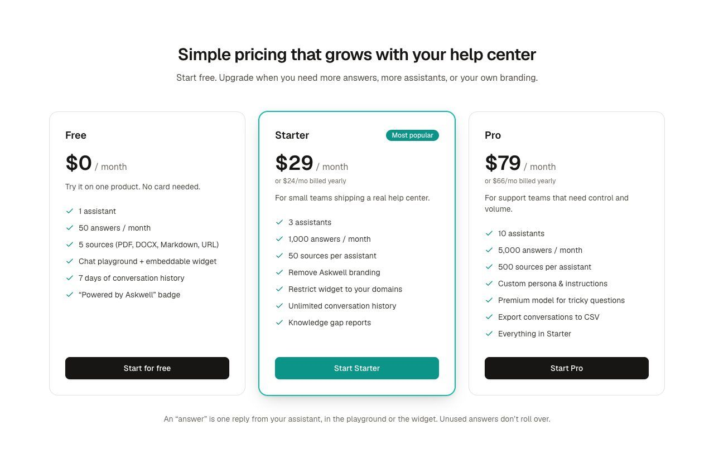

## 2. Sign up and create an assistant

Sign-up is email + password (Supabase Auth). A database trigger creates the billing profile, so the account is on the Free plan the moment it exists. The first screen after sign-up asks for one thing only: a name for the assistant. Everything else has sensible defaults.

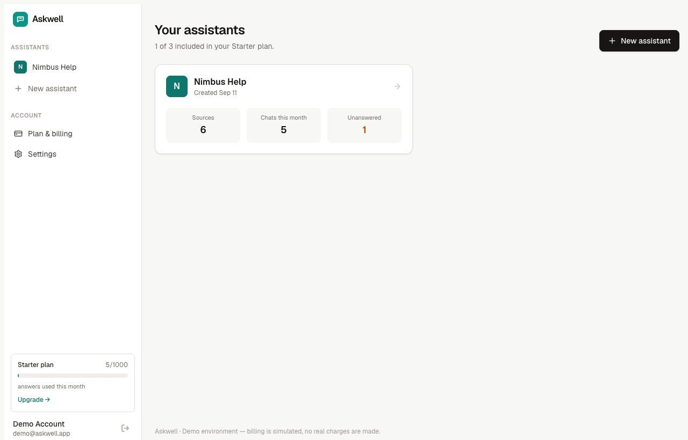

The dashboard shows every assistant with three numbers that matter to a support lead: how much it knows, how much it's used, and how often it had to say "I don't know".

## 3. Add knowledge

Knowledge comes from three places: **file uploads** (PDF, DOCX, Markdown, TXT, CSV, HTML — drag & drop, multiple at once), **pasted text**, or a **web page URL**. Each source is split into overlapping passages, embedded, and stored in pgvector. A typical help article is indexed in two to three seconds and is answerable immediately.

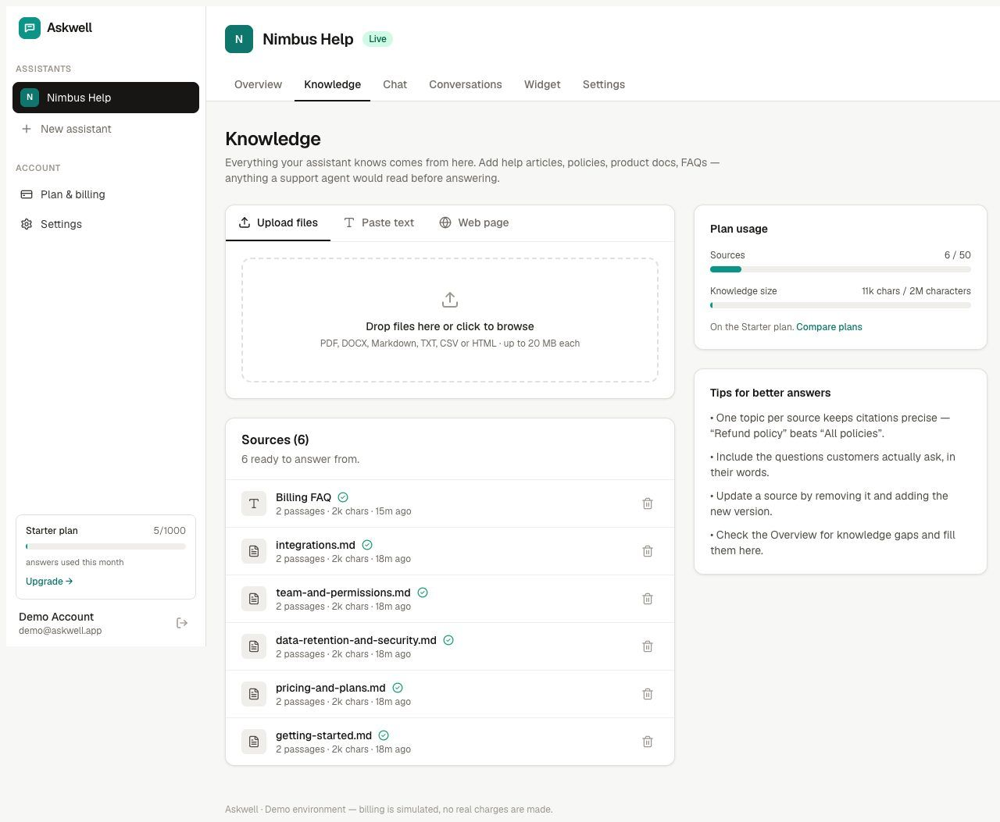

The right column shows plan usage (sources and total knowledge size). On the Free plan the sixth source is refused with a clear message and a link to plans — gating is enforced on the server, not just hidden in the UI.

## 4. Test it in the chat playground

The playground is the same engine the widget uses, so what you see here is exactly what visitors get. Replies stream token by token and carry **citation chips** naming the source(s) the answer came from.

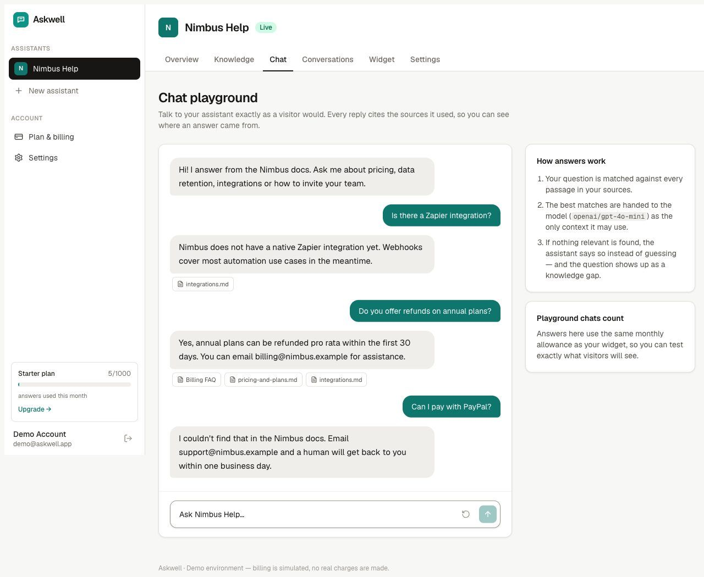

Two behaviours are worth noticing in the screenshot:

- *"Do you offer refunds on annual plans?"* — answered from the Billing FAQ, cited.
- *"Can I pay with PayPal?"* — the docs don't say, so the assistant uses the team's fallback message instead of inventing an answer. The retrieval + a strict "answer only from excerpts" prompt make this reliable, and a `[NO_ANSWER]` protocol lets the server record it as a **knowledge gap**.

Follow-up questions keep context: the last user turn is folded into retrieval so short questions like "and on annual plans?" still find the right passage.

## 5. Overview and knowledge gaps

The assistant's overview turns those gaps into a to-do list for the docs team: every question the assistant couldn't answer, linked to the full conversation. The answer rate at the top is the health metric a support lead actually cares about.

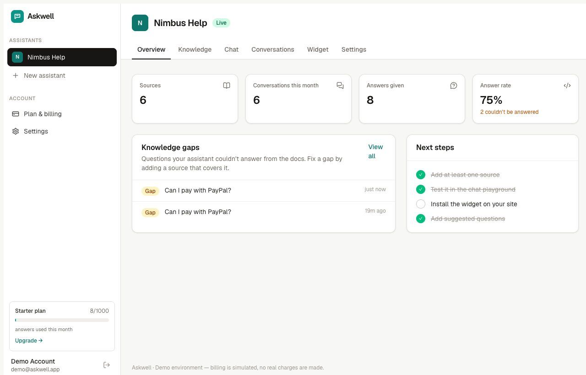

## 6. Conversations inbox

Every chat — from the playground or from the website widget — is logged with its channel and the page it was asked on. The **With gaps** filter shows only conversations where the docs fell short; unanswered replies are highlighted inline with an "add a source" shortcut. Pro accounts can export the list to CSV.

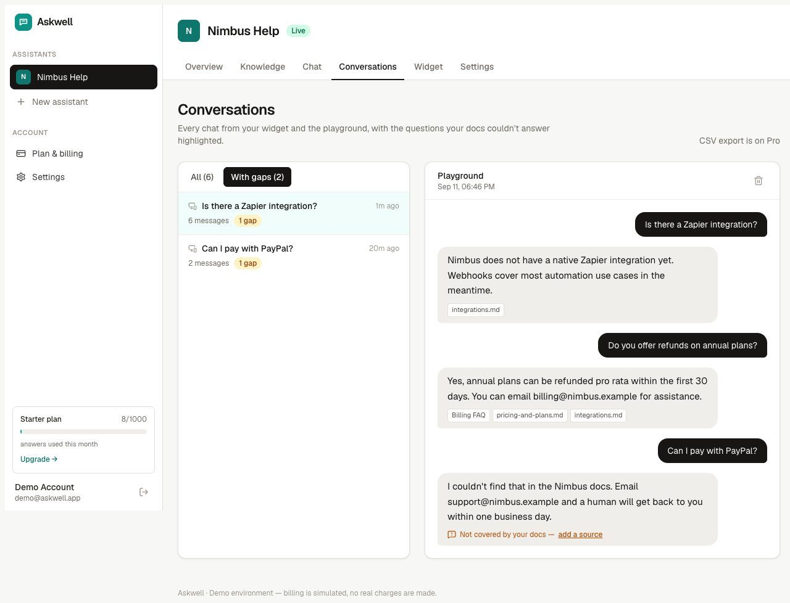

## 7. Embed the widget

Installing the widget is one script tag. The page also lets you pick an accent colour, the launcher label, up to four suggested questions, and (on paid plans) an allow-list of domains so nobody else can embed your assistant and burn your quota. The live preview on the right updates as you type.

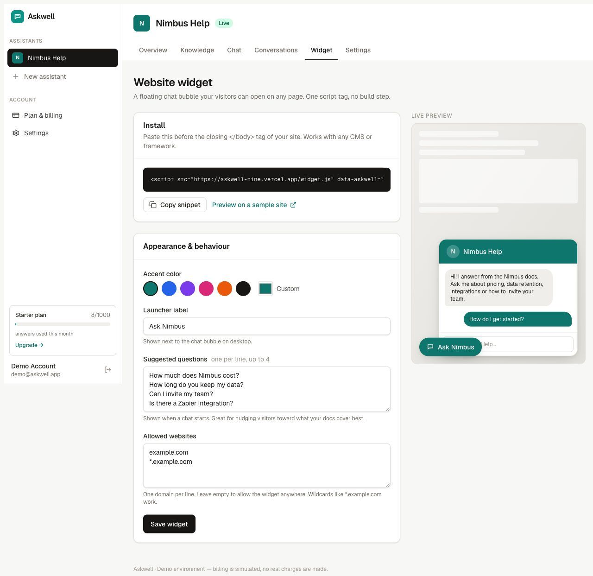

"Preview on a sample site" opens a fictional customer website with the widget already installed, so you can see the real thing without touching your own site:

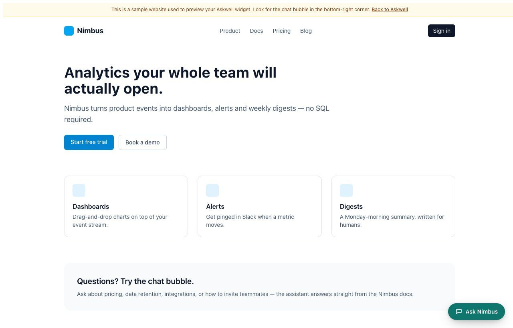

The widget opens as a floating panel (full-screen on phones), streams answers with the same citations, remembers the visitor's conversation across page loads, and closes with Escape or the ✕:

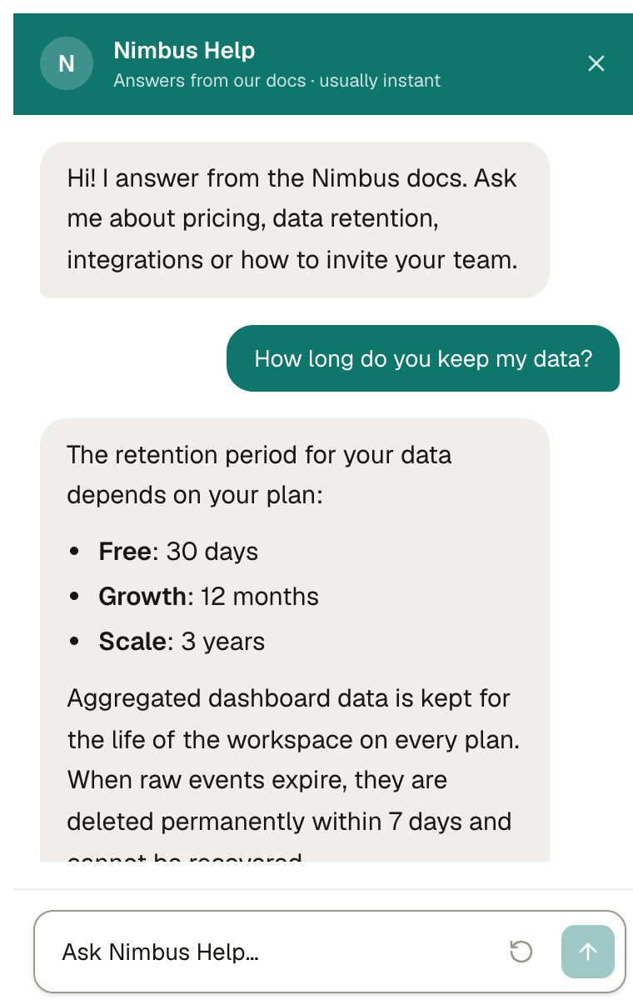

Technically the widget is a ~3 KB loader (`/widget.js`) that injects a launcher and an iframe pointing at `/embed/{public-key}`; answers go through a public, CORS-checked endpoint that validates the origin against the assistant's allow-list and rate-limits per visitor.

## 8. Plans and billing

Billing is fully wired but **simulated** — the card form validates numbers (Luhn) and mimics Stripe's test cards: `4242 4242 4242 4242` succeeds, `4000 0000 0000 0002` is declined. Upgrading creates an invoice, stores the card's last four digits, and flips every gate instantly (more assistants, more sources, branding removed, domain allow-list unlocked). You can switch between paid plans with the card on file, cancel at period end, resume, or — for demo purposes — end the period immediately.

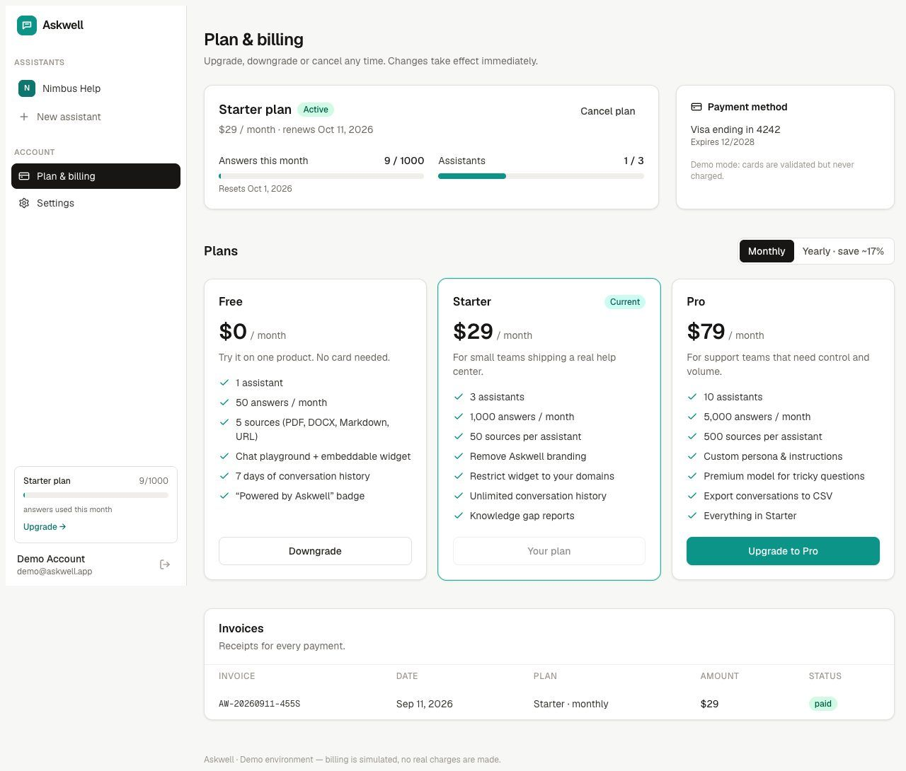

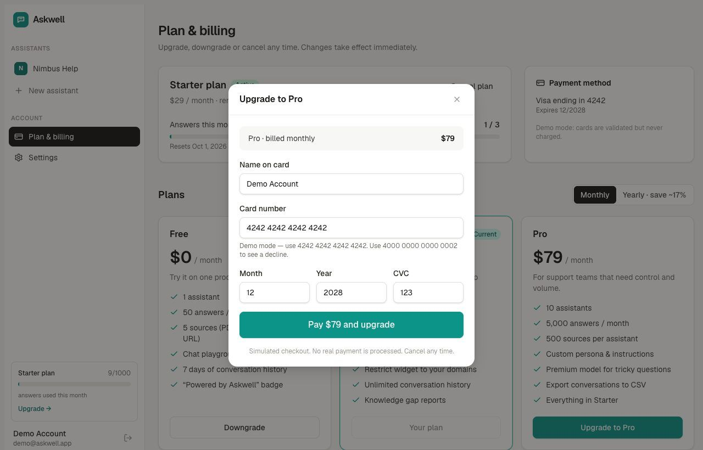

What each plan gates (enforced server-side in API routes and server actions):

| | Free | Starter $29 | Pro $79 |
|---|---|---|---|
| Assistants | 1 | 3 | 10 |
| Answers / month | 50 | 1,000 | 5,000 |
| Sources per assistant | 5 | 50 | 500 |
| Knowledge size | 200k chars | 2M chars | 10M chars |
| Conversation history | 7 days | Unlimited | Unlimited |
| "Powered by Askwell" badge | Yes | Removed | Removed |
| Domain allow-list | — | Yes | Yes |
| Custom persona / instructions | — | — | Yes |
| Model | standard | standard | premium |
| CSV export | — | — | Yes |

When the monthly allowance runs out, the playground asks the owner to upgrade, while the widget politely tells visitors the assistant is temporarily unavailable and points them to the fallback contact — nothing breaks on the customer's site.

## 9. Assistant settings

Name, welcome message and the fallback message ("what to say when the docs don't have an answer") are editable on every plan. Custom instructions (persona, house style) are a Pro feature and are shown locked with an upgrade link rather than hidden. An assistant can be paused, which makes the widget say it's unavailable, or deleted together with all its data.

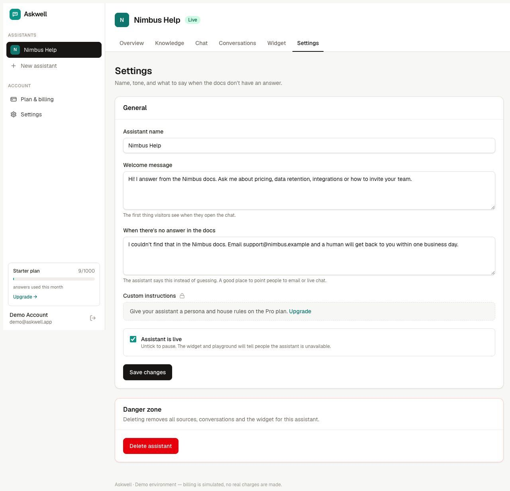

---

## How it works under the hood

```
upload / paste / URL ──► extract text ──► chunk (≈1400 chars, overlap) ──► embed ──► pgvector (HNSW)
                                                                                    │
question ──► embed ──► match_chunks() top-6 ──► strict system prompt ──► LLM (stream) ──► citations + [NO_ANSWER] detection
                                                                                    │
                                                              conversations / messages (RLS-protected) ──► inbox, gaps, usage metering
```

- **Isolation:** every table has row-level security keyed on the owner; the public widget endpoint uses the service role but only ever resolves data by the assistant's public key.
- **Metering:** each assistant reply is one "answer"; quotas are checked before every completion using a single SQL function.
- **Models:** all calls go through OpenRouter's OpenAI-compatible API, so the chat and embedding models can be swapped via environment variables without code changes.

## Run it yourself

See the README for a five-minute setup: create a Supabase project, run one SQL migration, add four environment variables, `npm run dev`.
